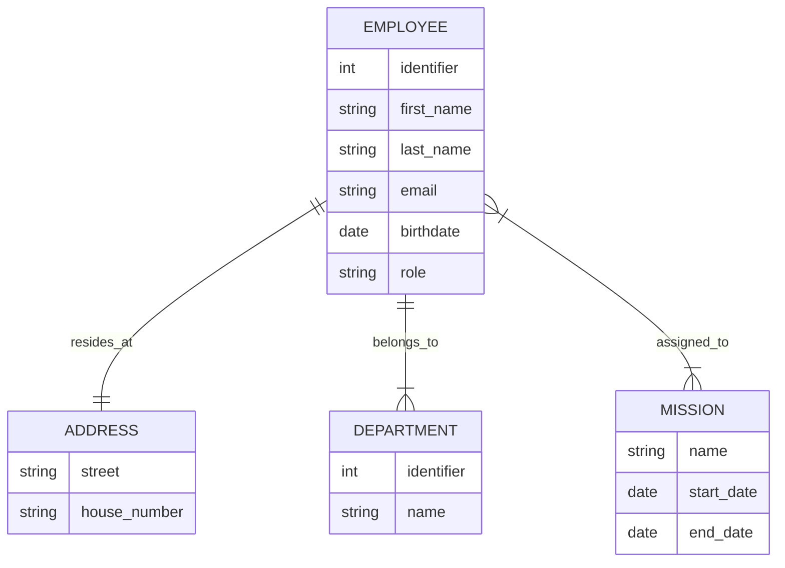

# Spring Data JPA Relationships

- Author: Bouali Ali.

- Language: English.

- [Source](https://www.youtube.com/watch?v=CvDS6DltIno).

## Model

```mermaid
erDiagram
    EMPLOYEE ||--|| ADDRESS : resides_at
    EMPLOYEE ||--|{ DEPARTMENT : belongs_to
    EMPLOYEE }|--|{ MISSION : assigned_to

    EMPLOYEE {
        int identifier
        string first_name
        string last_name
        string email
        date birthdate
        string role
    }

    ADDRESS {
        string street
        string house_number
    }

    DEPARTMENT {
        int identifier
        string name
    }

    MISSION {
        string name
        date start_date
        date end_date
    }
```
